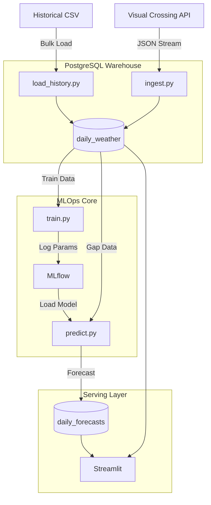

# Abuja MLOps Weather Pipeline

An end-to-end autonomous weather forecasting engine that ingests live sensor data, re-calibrates its internal state using rolling-window updates, and serves a 3-day temperature forecast via a Streamlit dashboard. The pipeline leverages a database-centric architecture to separate training from inference, ensuring high availability and drift adaptability.

> **Note (v1.0 Scope):** This initial release focuses exclusively on **Temperature Forecasting** as the foundational metric. The architecture is designed to scale easily to Humidity and Precipitation in future updates.

## A. Project Overview

This project demonstrates a complete MLOps lifecycle integrating:
- **Sensor Data** Historic data collected from [Visual Crossing](https://www.visualcrossing.com/weather-query-builder/abuja/?v=wizard) for Abuja
- **Visual Crossing Weather API** for real-time data extraction
- **PostgreSQL** for centralized data warehousing and state management
- **Auto-ARIMA** for seasonality detection ($m=7$) and trend analysis
- **MLflow** for experiment tracking and model registry
- **Walk-Forward Validation** for rigorous backtesting against local micro-climates
- **Streamlit** for user-facing visualization

## B. Data Architecture



## C. Tools & Technologies

| Layer | Tools |
| :--- | :--- |
| **Ingestion** | Python (Requests, Pandas), Visual Crossing API |
| **Storage** | PostgreSQL, CSV (Historical Logs) |
| **Processing** | Statsmodels (ARIMA), Scikit-Learn |
| **Tracking** | MLflow |
| **Serving** | Streamlit, Plotly |

## D. Features

- [x] **Hybrid Data Engineering:** Merges static historical logs with real-time API streams into a single source of truth.
- [x] **Stateful Inference:** Implements a "Rolling Update" mechanism (`refit=False`) to update model parameters daily without expensive full retraining.
- [x] **Quality Gating:** The `validate.py` script acts as a barrier, preventing poor-performing models from reaching production by enforcing MAE thresholds.
- [x] **Drift Handling:** Designed to adapt to Abuja’s distinct wet (Rainy) and dry (Harmattan) seasons.
- [x] **Decoupled Architecture:** The dashboard reads from the database, not the inference script, ensuring zero downtime during model updates.

## E. Pipeline Workflow

1.  **Ingest** real-time weather metrics via `ingest.py`.
2.  **Store** raw data into the PostgreSQL warehouse.
3.  **Train** the core model using Auto-ARIMA to identify parameters ($p,d,q$).
4.  **Validate** the model using Walk-Forward Cross-Validation.
5.  **Predict** the next 3 days by feeding "gap data" into the frozen model state.
6.  **Serve** the predictions via Streamlit, comparing them against live actuals.

## F. Project Folder Structure and Files Description

Here is an overview of the sub-directories and files. Under the `MLOps_Weather_Pipeline` main folder, we have:

* **`Data ingestion/` Directory:**
    Handles the "Extract" and "Load" phases of the pipeline.
    * `setup_db.py`: Initializes the PostgreSQL schema, creating optimized tables with composite primary keys and indexes for fast query performance.
    * `load_history.py`: Bulk loads the historical CSV dataset to seed the database.
    * `ingest.py`: The script. Connects to Visual Crossing API, formats the JSON response, and upserts it into the DB.

* **`models/`:**
    * `train.py`: Runs the Auto-ARIMA search, logs metrics (AIC/BIC) to MLflow, and registers the best model version.
    * `validate.py`: The Quality Assurance layer. It performs time-series cross-validation to calculate a realistic MAE before deployment.

* **`deployment/`:**
    Handles Operations and Serving.
    * `predict.py`: The inference engine. It loads the model from MLflow, fetches recent "gap data" from the DB, updates the model state, and writes the 3-day forecast back to the DB.
    * `app.py`: The user interface. A Streamlit dashboard that visualizes the forecast vs. actuals reading directly from PostgreSQL.

* **`images/` Directory:**
    Stores images and architecture diagrams for documentation.


## G. Setup Instructions

**Ensure you have PostgreSQL installed and an Visual Crossing API Key.**

### 1. Clone the repo
```
git clone https://github.com/ottneel/MLOps_Weather_Pipeline.git
cd MLOps_Weather_Pipeline
```

### 2. Set up Python virtual environment
```
python -m venv venv
source venv/bin/activate  # or venv\Scripts\activate on Windows
```

### 3. Install dependencies
```
pip install -r requirements.txt
```

### 4. Configure Environment
```
Create a .env file in the root directory:
DB_USER=postgres
DB_PASS=yourpassword
DB_HOST=localhost
DB_PORT=5432
DB_NAME=abuja_air_quality
VISUAL_CROSSING_API_KEY=your_api_key
MLFLOW_TRACKING_URI=./mlruns
```

### 5. Initialize the Pipeline
```
# Setup DB and load history
python ingestion/setup_db.py
python ingestion/load_history.py

# Fetch first batch of live data
python ingestion/ingest.py

```
### 6. Run the Dashboard
```
streamlit run deployment/app.py
```
## H. Future Improvements

* **Dockerization:** Containerize the ingestion and inference scripts to ensure consistent environments across local and cloud deployments.
* **CI/CD:** Implement GitHub Actions to automatically run the scripts without manual intervention.
* **Advanced Modeling:** Experiment with **LSTM** (Long Short-Term Memory) networks or **Facebook Prophet** to better capture long-term seasonal trends.
* **Alerting:** Integrate Email or Slack notifications to alert engineers immediately if the forecast MAE exceeds a specific safety threshold.

* Read the Article: [Building an Autonomous MLOps Weather Engine (Abuja, Nigeria)](https://medium.com/@ottneel/building-an-autonomous-mlops-weather-engine-abuja-nigeria-ff8e27e11df3)
